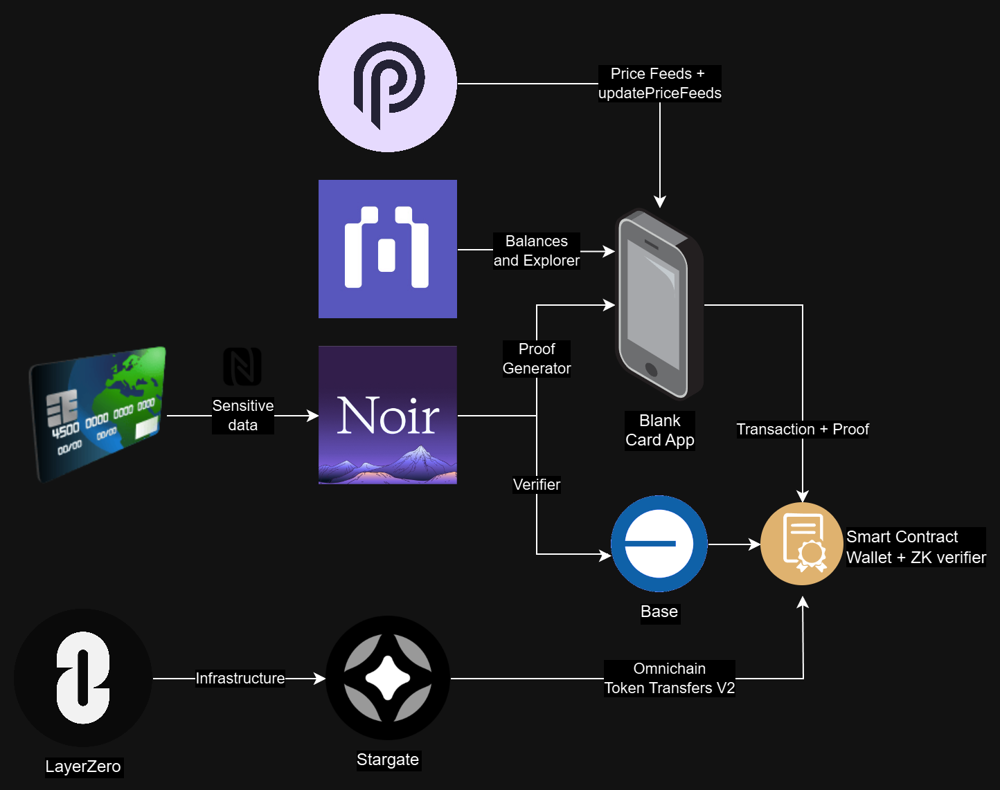

# Blank Card

Blank Card leverages ZK rollups to safeguard credit and debit cards from cloning while streamlining their integration into the crypto ecosystem.

# Intro:

In a world where digital transactions are becoming more common, credit and debit card security faces constant challenges such as fraud and cloning. In addition, the integration of traditional finance with the crypto ecosystem remains a complex and barrier-ridden process, hindering widespread adoption.

# Problem:

The problem with this is the exposure of sensitive data on traditional cards through their NFC, which makes them vulnerable to cloning and fraud.

# Solution:

**Blank Card** protects card payments from cloning and fraud by using **ZK rollups**, preventing sensitive data such as card number or CVV from being exposed during crypto and eventually traditional transactions.

# Diagrams:

# Noir and ZK Circuits:

To make the ZK circuits, Noir Lang was used, a circuit was developed which has 3 important checking characteristics.

- The number and exp number of the card correspond to the number when it was created.
- The expiration number has not expired, meaning it is still a valid card.
- Revision of the card number using the Luhn algorithm, which verifies that the card number passes a mathematical test.

The entire circuit as well as its ZK revision implementations are in the following link.

[CODE](./Circuit/main.nr)

# Base:

We use Base as our main chain, due to its low transaction costs and ability to seamlessly run ZK Verifiers from the Noir library.

    export const blockchains = [
    {
        network: 'Base',
        token: 'ETH',
        chainId: 8453,
        blockExplorer: 'https://base.blockscout.com/',
        api: 'https://base.blockscout.com/api/',
        rpc: 'https://base-mainnet.g.alchemy.com/v2/8EKVv8Jxrm4fGZBD2RyuEjBrAIu90Ynd',
        batchBalancesAddress: '0xA0D8A1940e4439e6595B74993Cc49f2d8364f7Ff',
        pyth: '0x8250f4aF4B972684F7b336503E2D6dFeDeB1487a',
        stargate:"0x27a16dc786820B16E5c9028b75B99F6f604b5d26",
        iconSymbol: 'eth',
        decimals: 18,
        tokens: [
        // Updated April/19/2024
        {
            name: 'Ethereum (Base)',
            symbol: 'ETH',
            address: '0x0000000000000000000000000000000000000000',
            decimals: 18,
            icon: iconsBlockchain.eth,
            coingecko: 'ethereum',
        },
        .
        .
        .
        
        ],
    },
    ];

All the data used to interact with Base is in the following code.
[CODE](./BlankCard/src/utils/constants.js)

# Blockscout:

All data coming from the chain, such as reading balances and transactions in our application, were done with Blockscount.

    async getBalancesBlockScout() {
    const publicKey = this.context.value.publicKey;
    return new Promise(async resolve => {
    const myHeaders = new Headers();
    myHeaders.append('accept', 'application/json');

    const requestOptions = {
        method: 'GET',
        headers: myHeaders,
        redirect: 'follow',
    };

    fetch(
        `${blockchains[0].api}v2/addresses/${publicKey}/token-balances`,
        requestOptions,
    )
        .then(response => response.json())
        .then(result => {
            const addresses = blockchains[0].tokens.map(x => x.address);
            const filtered = filterByAddress(result, 'address', addresses);
            let orderList = blockchains[0].tokens.map(x => x.symbol);
            orderList.shift(); // Remove ETH
            const values = filterAndSortValues(filtered, orderList);
            const bnValues = values.map(x => ethers.BigNumber.from(x));
            resolve(bnValues);
        })
        .catch(error => console.error(error));
        });
    }

All technical implementations of this code are in our app code.

[CODE](./BlankCard/src/screens/main/tabs/tab1.js)

# Pyth:

When making a payment, it is very important that the price data is accurate, so at the time of payment, an update and a fetch to the Pyth price feeds with Hermes is performed prior to the payment.

    async function getPythPrices() {
    const requestOptions = {
    method: 'GET',
    redirect: 'follow',
    };
    return new Promise(async resolve => {
    fetch(
        'https://hermes.pyth.network/v2/updates/price/latest?ids%5B%5D=0xff61491a931112ddf1bd8147cd1b641375f79f5825126d665480874634fd0ace&ids%5B%5D=0x9d4294bbcd1174d6f2003ec365831e64cc31d9f6f15a2b85399db8d5000960f6&ids%5B%5D=0xeaa020c61cc479712813461ce153894a96a6c00b21ed0cfc2798d1f9a9e9c94a&ids%5B%5D=0x41283d3f78ccb459a24e5f1f1b9f5a72a415a26ff9ce0391a6878f4cda6b477b&ids%5B%5D=0xb0948a5e5313200c632b51bb5ca32f6de0d36e9950a942d19751e833f70dabfd',
        requestOptions,
    )
        .then(response => response.json())
        .then(result => {
        resolve(
            result.parsed.map(
            item =>
                parseFloat(item.price.price) * Math.pow(10, item.price.expo),
            ),
        );
        })
        .catch(error => resolve([1, 1, 1, 1, 1]));
    });
    }

The implementation of these Price Feeds at the time of payment is implemented in the following link.

[CODE](./BlankCard/src/screens/main/tabs/tab3.js)

# Layer Zero:

In order to create an efficient payment method, relying only on one chain would be a bad strategy, so we use the Stargate platform to perform crosschain on payment, which means that at the time of making the payment we can decide the target chain for our tokens.

    // Crosschain Transfer

    function approveXUSDC(uint256 value) public onlyOwner {
        USDCContract.approve(stargatePoolUSDCAddress, value);
    }

    function transferXUSDC(
        SendParam calldata _sendParam,
        MessagingFee calldata _fee,
        bytes calldata _proof,
        bytes32[] calldata _publicInputs
    ) public payable{
        require(
            noirVerifier.verify(_proof, _publicInputs) == true,
            "Incorrect Proof"
        );
        stargatePoolUSDC.send{value: msg.value}(_sendParam, _fee, address(this));
    }
    
For now the implementation is done to work with USDC at the time of payment, but the entire contract can be found at the following link.

[CODE](./Contracts/BlankAccount.sol)
